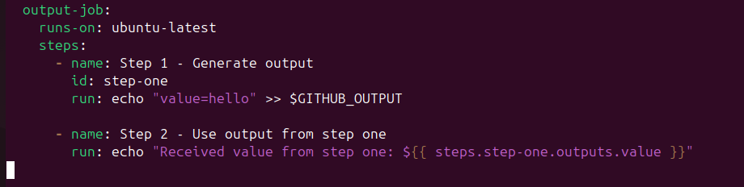

 HEAD
# Github_Action_And_CI-CD
Test CI workflow trigger
# Github_Action_And_CI-CD 

## Step 1: Open Your Repository
- Go to your project repository on GitHub.
If you don’t already have the repo locally, you can still do all of this directly in GitHub.

## Step 2: Create the Workflows Folder
- In your repo, click Add file → Create new file.

.

- Name the file:
.

## Step 3: Define the Workflow

Paste this code into the file:
.

## Step 4: Save and Commit
- Scroll down and type a commit message like:
.

## Step 5: Trigger the Workflow
- Now, the workflow will run automatically when you:

   - Push new code to the main branch, or

   - Open a pull request targeting main.

- To test it right away:

   - Edit any file in your repo (for example, README.md).

  - Commit the change.

  - Go to the Actions tab in your repo → you should see your CI Pipeline running.
.

.

#  Additional YAML Concepts in GitHub Actions

## Objectives:
- Deepen understanding of advanced YAML features used in GitHub Actions.

- Explore the use of environment variables and secrets in workflows.

## Step 1: Create a workflow folder and file
nano .github/workflows/advanced.yml
This file is where we will write the YAML workflow.

# Step 2: Start the workflow and define environment variables
- Paste this at the top of advanced.yml:
.

Explanation:
- env: defines a variable CUSTOM_VAR that all jobs can use.

- on: specifies triggers: push to main or manual trigger.

# Step 3: Add a job to use the environment variable
.

Explanation:
- env-job prints the value of CUSTOM_VAR.

# Step 4: Add a job to use secrets
- Before we do this step, add a secret in GitHub:

- Go to your repo → Settings → Secrets and Variables → Actions → New repository secret
.

.

.

- Name it ACCESS_TOKEN (or whatever you like)

- Put any value (fake token is fine for testing)

- Now add this job to advanced.yml:
.

# Step 5: Add conditional execution job
.

Explanation:
- The job only runs if the workflow is triggered by a push to the main branch.

# Step 6: Add a job to demonstrate step outputs
  .

  Explanation:
- step-one sets an output variable value.

- step-two accesses it.

# Step 7: Save and commit workflow
git add .github/workflows/advanced.yml
git commit -m "Add advanced GitHub Actions workflow example"
git push origin main

# After running, check Actions tab:

Green check → all steps passed.
.

# Configuring Build Matrices

## Step 1: Understand what a build matrix is
- A matrix allows GitHub Actions to run the same job multiple times with different configurations.

- Example: run tests on Node 16, 18, and 20 or on multiple OSes (ubuntu, macOS, windows) in parallel.

- This saves time because jobs run concurrently instead of sequentially.

# Step 2: Start a new workflow file
- Create a new file " nano .github/workflows/matrix.yml"

- Add the basic structure:
.

# step 3: Define a matrix for Node.js versions
.

Explanation:
- strategy.matrix.node-version → GitHub creates 3 parallel jobs, one for each Node version.

- ${{ matrix.node-version }} → refers to the current Node version in each job.

- This allows you to test your project across multiple Node environments automatically.

# Step 4: Optional — Add multiple OSes
.

This creates 6 jobs total (3 OS × 2 Node versions).

Useful if you want to ensure cross-platform compatibility.

# Step 5: Save, commit, and push

.
>>>>>>> 5acf9bc (summitting project on github action ci/cd)

